# What it does

A walk through the product, one feature at a time, with the screen each one produces.
Every image here is the running app, captured by `scripts/demo_shots.py` rather than drawn.

Two apps share one server and one database. The elder installs **Hallo** on her phone; her
family installs **Hallo Care** on theirs. Nothing is synced between two systems, because
there is only one.

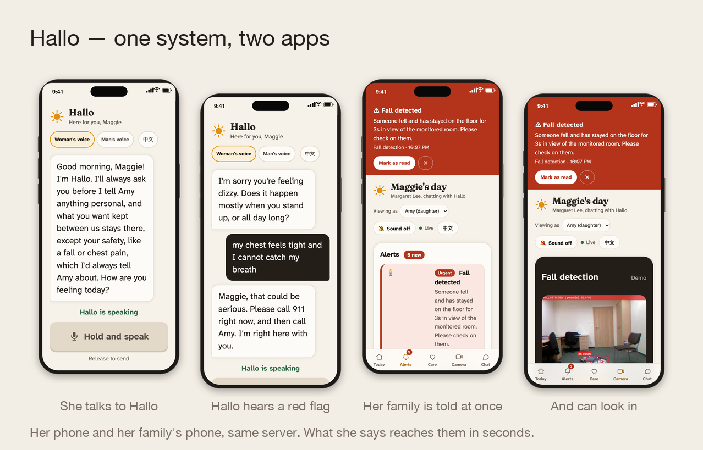

---

## The elder's app

### One screen, one control

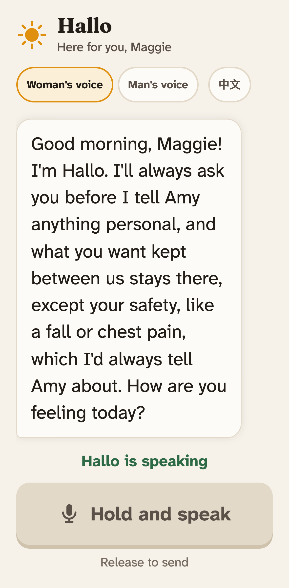

Opening the app greets her by name and by time of day, and picks up a thread from before:
here, yesterday's knee. She never navigates. There is no menu, no tab bar, no settings she
can get lost in — the only thing to do is hold the bar and talk, and the reply is read
aloud.

The numbers behind that screen are deliberate:

| | |
|---|---|
| Body type | 23px |
| Talk control | 84px tall, full width |
| Lowest contrast ratio | 4.5:1 |
| Typeface | Atkinson Hyperlegible, drawn for low vision |

Those clear the floors in WeChat's Care Mode specification (22px body) and China's MIIT
accessibility standard for apps (≥18dp, ≥1.3 line spacing, ≥4.5:1). The control is a bar
rather than a round button because that is the shape this audience already has muscle
memory for, from voice messages.

### Symptoms come out of ordinary conversation

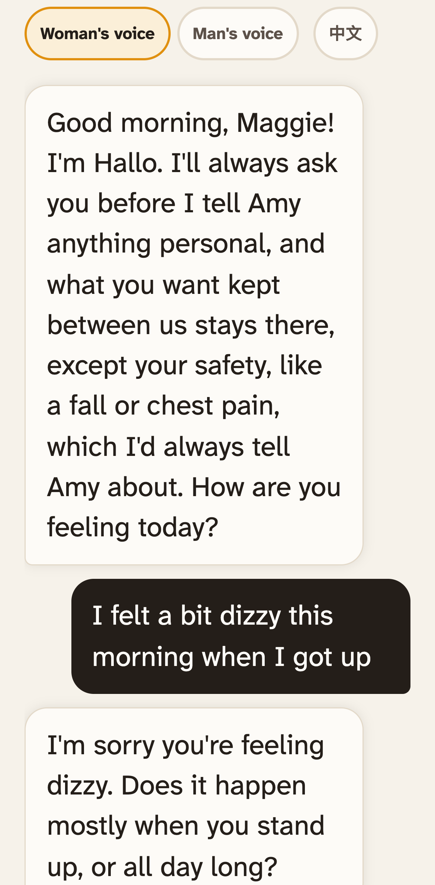

She is not filling in a health form. She mentions feeling dizzy, the way anyone would, and
the companion responds like a person: one short sentence of concern, then exactly one
question. Behind that turn, the symptom is extracted, given a severity and a status, and
filed against a fixed catalogue.

### It knows when to stop asking questions

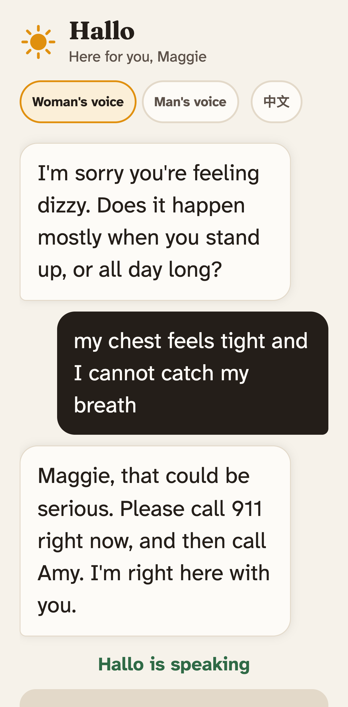

Chest tightness with trouble breathing is a red flag. The companion does not ask a
follow-up, does not guess a cause, and does not name a medicine. It tells her to call
emergency services now, then to call her daughter, and says it is staying with her.

The rule is in the prompt and covered by tests: never diagnose, never name a drug or dose,
never tell her to start or stop a medication.

---

## The family's app

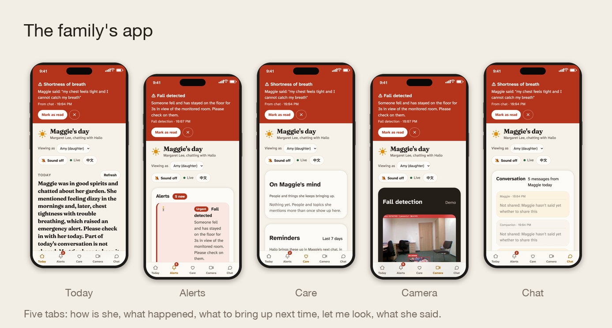

Five tabs, in the order a worried family member actually asks: how is she, what happened,
what should the companion bring up next time, let me look, what did she say.

### Today: one answer, not a wall of tiles

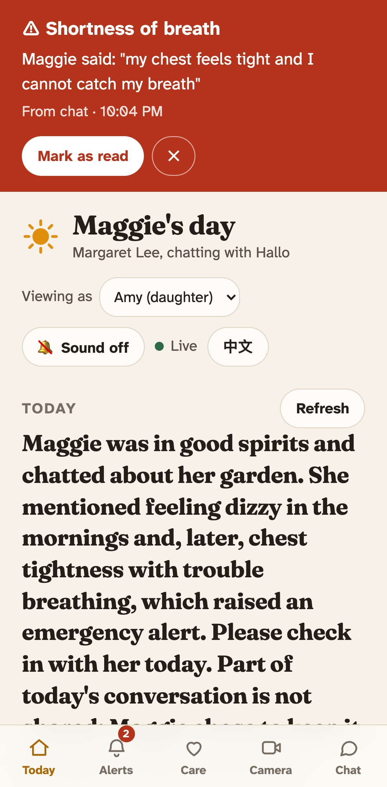

A written summary of her day in plain language, then the symptom timeline behind it. Quiet
days collapse into a single row that still names the range it covers, so a week of nothing
takes one line rather than seven, and nothing silently disappears from the record.

From here the family can also open the printable weekly report, a doctor one-pager, and a
memoir of her stories.

### Alerts: everything that happened, in one stream

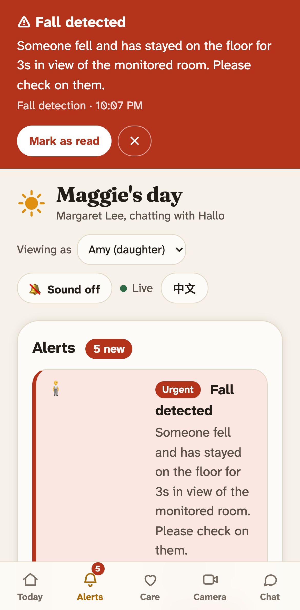

Chat symptoms and fall detections arrive in the same list, newest first, each quoting what
she actually said or showing the frame the camera caught. An urgent alert pushes to the
open dashboard over a live connection, switches to this tab on arrival, and badges it with
the unread count.

Siblings share one view: "I'll handle this" marks a claim, so two children do not both
phone her about the same thing.

### Care: what she is carrying, and what to bring up

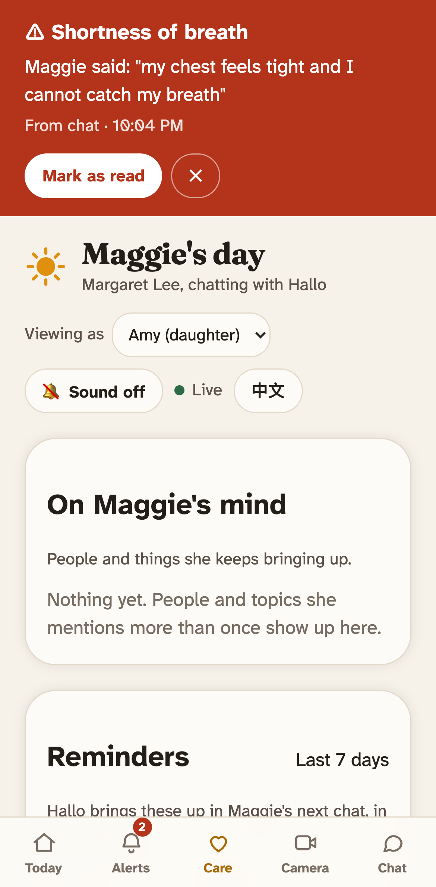

The companion notices what she keeps returning to — people, worries, small plans — and
lists it. Underneath, the family writes a reminder in their own words. The companion raises
it in her next chat, repeating that wording, and never adds a dose or medical advice of its
own. Her answers come back as a row of dots, one per day, so adherence reads at a glance
and works in print and for a colour-blind reader.

### Camera: fall detection, live

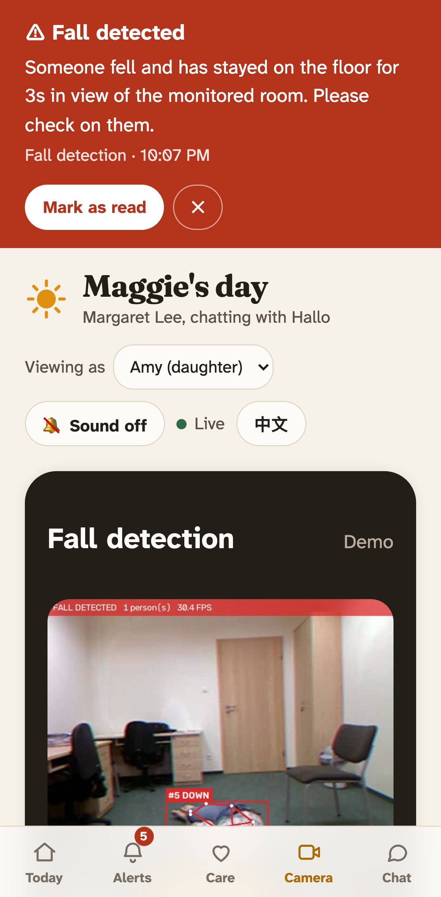

YOLO11-pose runs on the video and tracks each person's state. A person who goes down and
stays down for three seconds raises an alert with the frame attached. The panel shows the
annotated feed, and switches between a real camera and a demo playlist for rehearsal.

Fall detection is a separate service exposed over MCP, so the dashboard, Claude Desktop and
Cursor can all query it. The video reaches the page through the main app's own origin,
which is what lets a phone see it at all: a phone cannot reach the detector's port, and an
HTTPS page blocks a plain-HTTP image before the request is made.

### Chat: the transcript

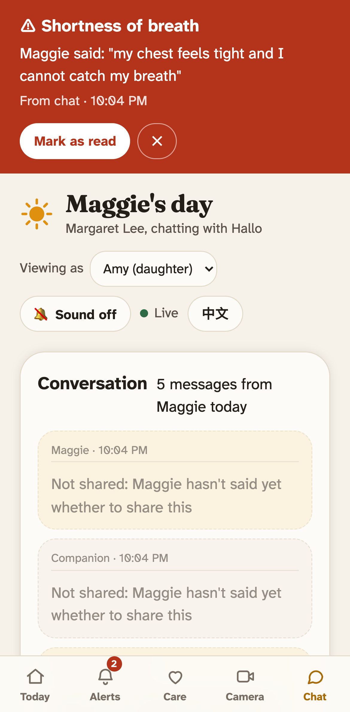

When the summary is not enough. Turns she asked to keep private appear marked rather than
missing, so the family can see that something was held back instead of quietly not being
there.

---

## Privacy is a feature, not a disclaimer

"Keep this between us" removes that part of the conversation from every family view, while
the companion still remembers it. Urgent safety alerts — a fall, chest pain — always go
through, and she is told that up front.

In the code, the privacy filter runs before anything is translated or formatted for
display, so what she asked to keep private cannot reach the page in any language.

---

## Both languages, one switch

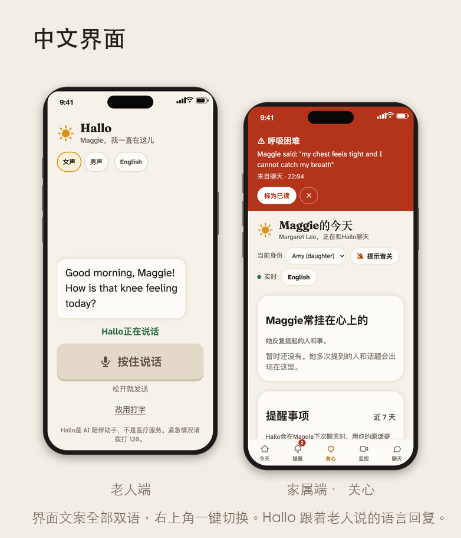

The interface ships in English and Simplified Chinese. A switch in each header sets the
language for that browser, so the elder can read Chinese while her family reads English.

Two things deliberately do not follow the switch. The companion's replies and the daily
summary follow the language **she** actually spoke. So does the line spoken back to her when
speech could not be understood: a Chinese speaker hears Chinese even if her family set the
dashboard to English.

---

## It installs like an app

Both surfaces install to a phone home screen with their own name and icon, and open full
screen with no browser chrome. The shell is precached, so the app still opens when the
venue wifi drops; everything live — chat, alerts, the camera — always goes to the network
and is never served from cache.

A phone needs an HTTPS address to install; a LAN address will not do. See the README.

---

## On a laptop

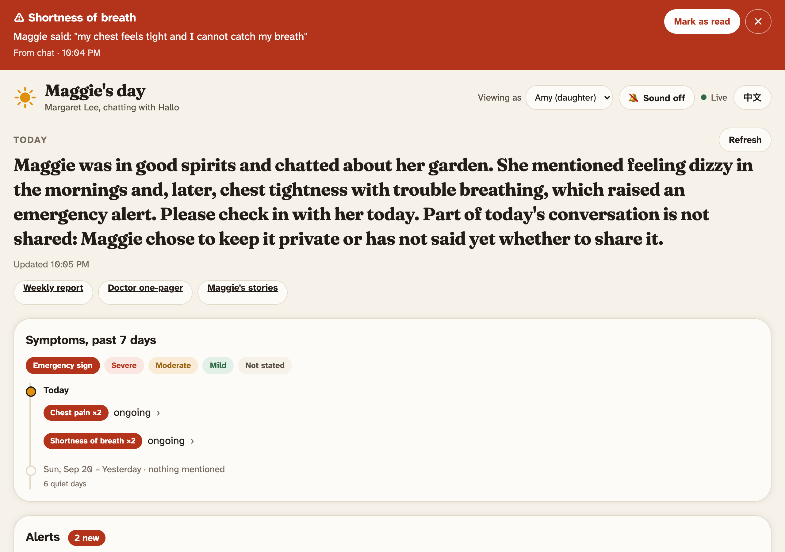

The same dashboard, one column widened, with the tab bar out of the way because there is
room for everything at once.

The printable reports are built for paper:

| Report | What it is |
|---|---|
| 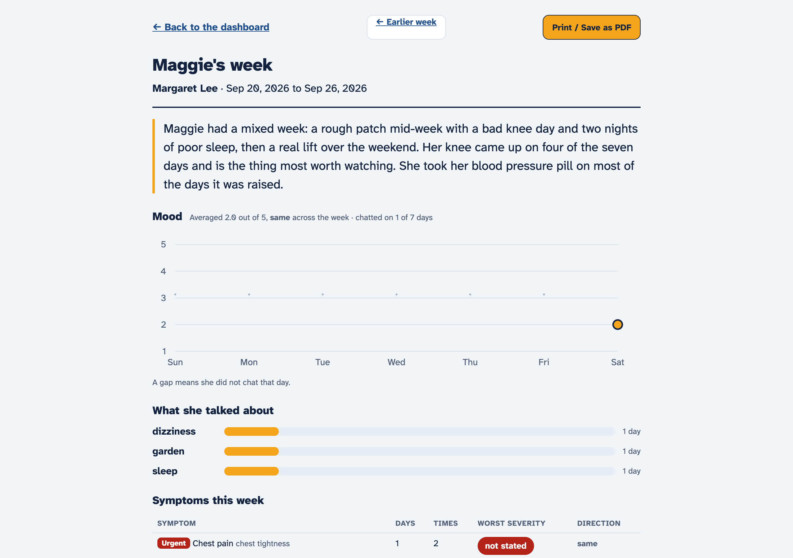 | Mood trend, most-discussed topics, symptom trends, reminder adherence |
| 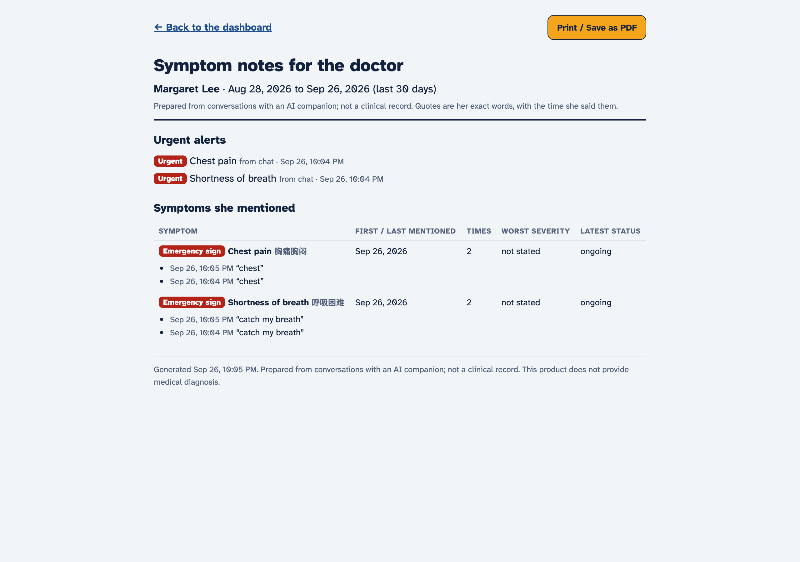 | A one-pager for an appointment, assembled without an LLM |
